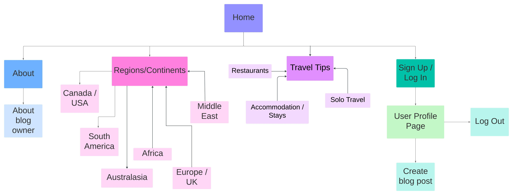
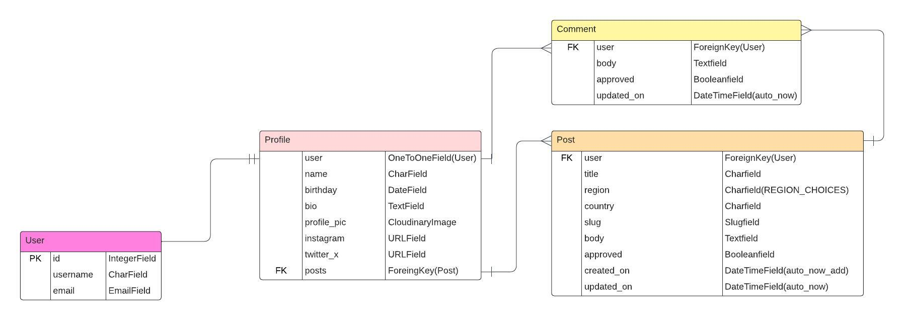
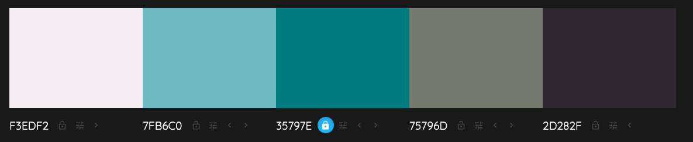
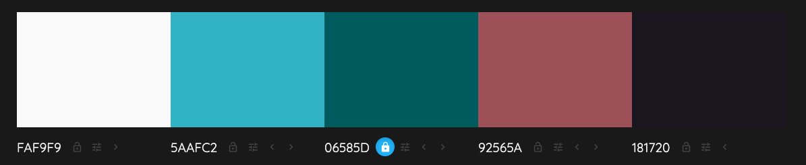
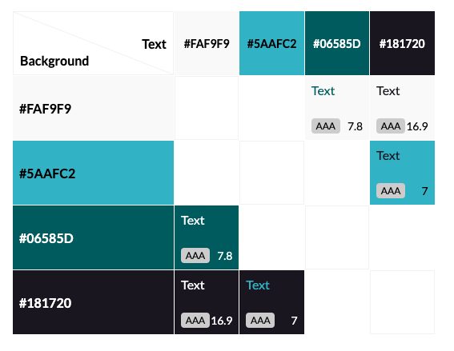
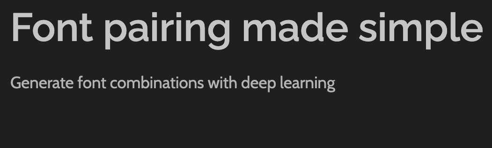
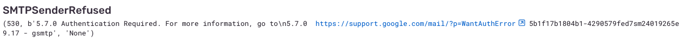
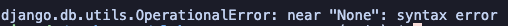
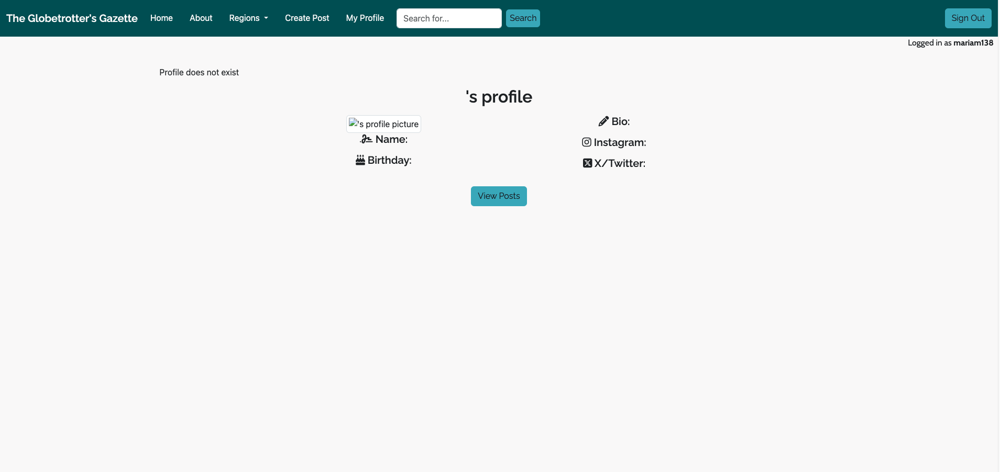
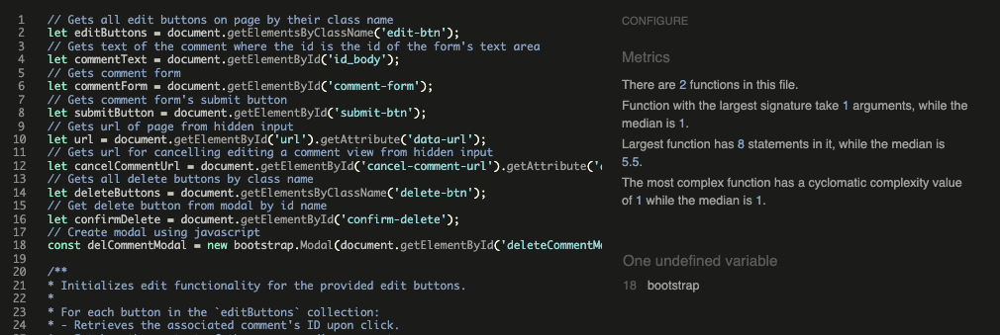

# The Globetrotter's Gazette
## Introduction

Welcome to the Globetrotter's Gazette, a place to share your travel experiences from all around the world. Read posts from all different countries, share these posts, even join in the conversation by leaving a comment! This is a community for globetrotter's alike to come together and share their love of travelling.

This website is made using the Django framework, alongside HTML, CSS, Javascript and Python. This is the 4th project in the Full Stack Software Development Diploma from Code Institute.

## Table of Contents

## User Experience (UX)

Development of this blog site was done using the five planes of UX as guidance. Below are the details listed for each plane.

### The Strategy Plane

The goal of 'The Globetrotter's Gazette' is to create an online community for people who love to travel, allowing them to share their experiences with each other. Users can create blog posts to share with others and can also search for other blog posts of their interest.

#### Business Needs

- Create a website for people to share their travel stories
- Allow travellers - novice and experienced - to get inspiration for their next trip

#### User Needs

- Blog about my travels to be able to store my memories online
- Read about others' experiences to get ideas for my next holiday/ expand my knowledge
- Engage with others and their travels by commenting on posts
- Be able to create an account to leave comments
- Be able to create an account to create my own posts

### The Scope Plane

#### Epics

7 epics were generated for this project, which were further broken down into user stories before starting development. Each epic and their related user stories can be seen on my [project board](https://github.com/users/mariam138/projects/6/views/1).

**Epic [1](https://github.com/mariam138/globetrotters-gazette/issues/2)**: Initial Django Setup  
**Epic [2](https://github.com/mariam138/globetrotters-gazette/issues/3)**: User Authentication  
**Epic [3](https://github.com/mariam138/globetrotters-gazette/issues/4)**: User Profile  
**Epic [4](https://github.com/mariam138/globetrotters-gazette/issues/5)**: User Travel Posts  
**Epic [5](https://github.com/mariam138/globetrotters-gazette/issues/6)**: Searching Travel Posts  
**Epic [6](https://github.com/mariam138/globetrotters-gazette/issues/7)**: Admin Profile  
**Epic [7](https://github.com/mariam138/globetrotters-gazette/issues/8)**: User Interaction  

#### User Stories

The seven epics listed above were split down further into user stories to help with the development of the project. User stories were labelled using **MoSCoW Prioritisation**. User stories were also labelled with story points, based on relative effort. For each iteration, a **milestone** was created to keep track of user stories. **Must have** stories were worked on first during each iteration, followed by **Should have** and finally **Could have**. User stories labelled with **Won't have** remained in the [Back log](https://github.com/mariam138/globetrotters-gazette/milestone/1) milestone. Any user stories that were start but not completed at the end of the iteration would be prioritised first in the next iteration. Below is a list of completed user stories, categorised by their respective epics:

##### **Epic [1](https://github.com/mariam138/globetrotters-gazette/issues/2)**: Initial Django Setup
- [#9](https://github.com/mariam138/globetrotters-gazette/issues/9#issue-2388350667) Initial Django Setup
- [#10](https://github.com/mariam138/globetrotters-gazette/issues/10#issue-2388393796) Connect Database to Django Project
- [#11](https://github.com/mariam138/globetrotters-gazette/issues/11#issue-2388393796) Create Environment Variables
- [#56](https://github.com/mariam138/globetrotters-gazette/issues/56#issue-2388393796) Deployment of Blog

##### **Epic [2](https://github.com/mariam138/globetrotters-gazette/issues/3)**: User Authentication
- [#13](https://github.com/mariam138/globetrotters-gazette/issues/13#issue-2388393796) Log into Site
- [#61](https://github.com/mariam138/globetrotters-gazette/issues/61#issue-2388393796) Register for Site
- [#14](https://github.com/mariam138/globetrotters-gazette/issues/14#issue-2388393796) Log Out of Site

##### **Epic [3](https://github.com/mariam138/globetrotters-gazette/issues/4)**: User Profile
- [#16](https://github.com/mariam138/globetrotters-gazette/issues/16#issue-2388393796) Create User Profile
- [#17](https://github.com/mariam138/globetrotters-gazette/issues/17#issue-2388393796) View User Profile
- [#18](https://github.com/mariam138/globetrotters-gazette/issues/18#issue-2388393796) Edit User Profile
- [#63](https://github.com/mariam138/globetrotters-gazette/issues/63#issue-2388393796) Upload Profile Picture
- [#59](https://github.com/mariam138/globetrotters-gazette/issues/59#issue-2388393796) View Own Posts
- [#19](https://github.com/mariam138/globetrotters-gazette/issues/19#issue-2388393796) Delete User Account

##### **Epic [4](https://github.com/mariam138/globetrotters-gazette/issues/5)**: User Travel Posts
- [#23](https://github.com/mariam138/globetrotters-gazette/issues/23#issue-2388393796) Read Blog Posts
- [#22](https://github.com/mariam138/globetrotters-gazette/issues/22#issue-2388393796) Create Travel Posts
- [#57](https://github.com/mariam138/globetrotters-gazette/issues/57#issue-2388393796) Upload Pictures to Blog Posts
- [#24](https://github.com/mariam138/globetrotters-gazette/issues/24#issue-2388393796) Edit User Posts
- [#25](https://github.com/mariam138/globetrotters-gazette/issues/25#issue-2388393796) Delete User Posts

##### **Epic [5](https://github.com/mariam138/globetrotters-gazette/issues/6)**: Searching Travel Posts
- [#29](https://github.com/mariam138/globetrotters-gazette/issues/29#issue-2388393796) View Paginated List of Posts
- [#28](https://github.com/mariam138/globetrotters-gazette/issues/28#issue-2388393796) Group Posts by Country/Region
- [#64](https://github.com/mariam138/globetrotters-gazette/issues/64#issue-2388393796) Search for Posts
- [#55](https://github.com/mariam138/globetrotters-gazette/issues/55#issue-2388393796) Display Travel Pictures on Home Page
- [#67](https://github.com/mariam138/globetrotters-gazette/issues/67#issue-2388393796) Create 404 Page

##### **Epic [6](https://github.com/mariam138/globetrotters-gazette/issues/7)**: Admin Profile
- [#33](https://github.com/mariam138/globetrotters-gazette/issues/33#issue-2388393796) Create Admin Profile
- [#34](https://github.com/mariam138/globetrotters-gazette/issues/34#issue-2388393796) View Admin Profile
- [#35](https://github.com/mariam138/globetrotters-gazette/issues/35#issue-2388393796) Edit Admin Profile
- [#42](https://github.com/mariam138/globetrotters-gazette/issues/42#issue-2388393796) Moderate Comments
- [#39](https://github.com/mariam138/globetrotters-gazette/issues/39#issue-2388393796) View About Page
- [#38](https://github.com/mariam138/globetrotters-gazette/issues/38#issue-2388393796) Create About Page
- [#40](https://github.com/mariam138/globetrotters-gazette/issues/40#issue-2388393796) Update About Page

##### **Epic [7](https://github.com/mariam138/globetrotters-gazette/issues/8)**: User Interaction
- [#43](https://github.com/mariam138/globetrotters-gazette/issues/43#issue-2388393796) Create Comments
- [#44](https://github.com/mariam138/globetrotters-gazette/issues/44#issue-2388393796) View Comments
- [#45](https://github.com/mariam138/globetrotters-gazette/issues/45#issue-2388393796) Edit Comments
- [#46](https://github.com/mariam138/globetrotters-gazette/issues/46#issue-2388393796) Delete Comments

### The Structure Plane

For the structure, I briefly created a simple site map. This allowed me to make sure there was flow throughout the design of the website, and that the correct pages linked together. This was created before the creating each page and was used as a template. The site map was created using **Lucidchart**.

ERD diagrams were created to plan out the models to be used in the project. I settled on 3 models: a **Post** model, a **Comment** model and a **Profile** model. Below shows the database schema and the relationships between the models.

The ERD diagram was created using [Lucid Charts](https://lucid.co/).

### The Skeleton Plane

To create the skeleton of the website, I created wireframes using **Balsamiq**. Alternate versions were created in the application, as for some pages I wasn't entirely certain on the final layout. Listed below are the **final** versions of the wireframes used to create the layout of the website on desktop, tablet and mobile.

### The Surface Plane

#### Colour Scheme

The colour I wanted to choose to be the main standout colour was a bluey-gree, akin to the rivers or seas. After picking the colour `#35797e`, I then decided to generate a colour palette appropriate for a website using [Colormind](colormind.io/bootstrap). Setting `#35797e` as the main colour, the below palette was generated.

I then went to check the accessibility of these colours to ensure they were visible to all readers. I liked the light `#F3EDF2` colour, so checked to see if the main colour `#35797e` would get a **AAA** rating according to the WGAC contrast. Using this [accessible colour generator](https://www.learnui.design/tools/accessible-color-generator.html), a darker main colour `#06585d` was given instead. So I decided to regenerate the palette.

I checked the accessibility of the white and black colours against the blue shades using the [EightShapes Contrast Grid](https://contrast-grid.eightshapes.com/?version=1.1.0&background-colors=&foreground-colors=%23FFFFFF%2C%20White%0D%0A%23F2F2F2%0D%0A%23DDDDDD%0D%0A%23CCCCCC%0D%0A%23888888%0D%0A%23404040%2C%20Charcoal%0D%0A%23000000%2C%20Black%0D%0A%232F78C5%2C%20Effective%20on%20Extremes%0D%0A%230F60B6%2C%20Effective%20on%20Lights%0D%0A%23398EEA%2C%20Ineffective%0D%0A&es-color-form__tile-size=compact&es-color-form__show-contrast=aaa&es-color-form__show-contrast=aa&es-color-form__show-contrast=aa18&es-color-form__show-contrast=dnp). The following graph shows all of the passing **AAA** colours.

As all of the shades passed with **AAA**, I settled on these colours as my final colour palette.

#### Typography

For fonts, I started out choosing a font for headings. I used [Fontjoy](https://fontjoy.com/) to generate random fonts at first. I came across the font **Raleway** and liked that it was simple and clean, so decided on that for my headings. Then I searched up the **Raleway** font on [typ.io](https://typ.io/) to get suggestions for a font I could use for my paragraphs that pair well with **Raleway**. After looking at a few options, I decided on using **Cabin**. I chose it for it's similarity to **Raleway** in that it was also clean and easy to read, as I was also taking accessibility into consideration with my fonts. Below is a picture of the two fonts side by side, with the image taken from **Fontjoy**.

## Features

## Future Features

## Bugs

1. While writing the code to edit a user's profile, I came across an *Integrity Error* when trying to save the model in the **edit_profile** view. Below is the detailed message of the Integrity error:

    > DETAIL: Key (user_id)=(13) already exists.

    I found a solution on the following [Google Groups](https://groups.google.com/g/django-users/c/Pq-3UatNP60?pli=1) post. As I had set up my **user** field in my **Profile** model as a **one to one** relationship, adding `primary_key=True` helped to fix the duplicate key value issue.

2. I wanted to implement client-side uploading of profile images for users to upload and change their profile image as part of CRUD functionality. I used the **Django Crispy Forms** package to quickly create a form based on the **Profile** model I had created. This created a simple *'Upload'* form field for a user to upload their profile picture. When the button was clicked, it lead to opening the user's own local files to choose a picture from. I wanted to include **Cloudinary**'s file upload widget for a better UI, so followed the steps to implement this. This all worked, except that when clicking the *'Choose files'* button, it would trigger **both** the local files on the user's computer to open, followed by the Cloudinary widget. Initially to overcome this, I tried to change the default widget that Crispy Forms rendered by creating a **CloudinaryFileInput** class which inherited from Django's **ClearableFileInput** class, which then would render a `<button>` element instead. I did this so that the local computer storage wasn't triggered to open when clicked. However, this didn't seem to work. In the end I found it difficult to implement the Cloudinary Upload widget with the pre-rendered Crispy Forms Profile Form, so changed route and tried to do a direct upload to the Cloudinary server without using the Upload widget. At first, any picture uploaded would not save to Cloudinary. I imported the *'CloudinaryFileField'* class into my **forms.py** file to then specify that the upload would be a Cloudinary file. Although this helped, whenever I tried to then upload a picture, the error message set up using Django's messaging framework would appear. After searching for why this was occurring, it turned out to be that I had not added the **enctype** attribute to my ,<form>, element. Once adding that, I could finally upload pictures to Cloudinary and have them appear on a profile page.

3. While creating the *Profile* model and it's functionality, I managed to get all of it working in the local server with no status errors. However, after a manual deployment, I came across a **Server 500** status code when trying to click on the *'My Profile'* link in the navbar when logged in. This error had not shown at all during local development. To be able to get a full trace of the error which was more detailed than the *Heroku logs*, I added my email into an **ADMINS** variable in **settings.py**. This allowed detailed errors to be e-mailed to me everytime the error occured. After setting all the desired email configurations, I tried to send test emails and access the deployed site to see if the e-mails would send. However, I could not get the emails to send. I initially set up my **Gmail** to be the receiver, but even when testing a sent email using python, I got the following error message:

        `smtplib.SMTPSenderRefused: (530, b'5.7.0 Authentication Required. For more information, go to\n5.7.0  https://support.google.com/mail/?p=WantAuthError 5b1f17b1804b1-427f941377csm117778905e9.48 - gsmtp', 'webmaster@localhost')`

    I read on several websites that I should allow access to less secure apps for my Gmail, but found that this option was only accessible to administrator accounts. As it was a personal account, and I did not have an administrator account, this method did not work in the end. I tried to overcome this by using my **Yahoo** mail account instead. However, even after following the same steps to set it all up, when sending a test email, I would get the following error:

        `smtplib.SMTPSenderRefused: (554, b'Email rejected', 'XXXX@yahoo.co.uk')`

    After checking all my configurations were correct using different websites as resources, I found that I came to a dead-end with using my own email to receive the traces as they would block emails sent from Django.

    Another alternative I found was to use [**Sentry**](sentry.io) and set it up with my Django application. Following the docs to install it with regards to Django, I was able to receive email alerts and also view specific errors and their tracebacks on the Sentry dashboard. However, I found that I couldn't get this to work for the deployed site. While testing Sentry in the deployed site, I found that I had accidentally pushed my project with **Debug** set to `True` rather than False. So when accessing the profile page, I managed to get a detailed error and traceback. I received a **ValueError**:

        `ValueError at /profile/mariam138/ Must supply cloud_name in tag or in configuration`

    This caused me to go back and check my configuration for Cloudinary. I reread through the installation documentation to check how I had configured my Cloudinary URL. It appeared that when I had set up a new cloud in my Cloudinary console, I didn't update my Cloudinary URL to contain the new API secret key. Updating the URL to the correct value fixed the issue, allowing me to properly access the profile page on the deployed site.

4. For a user editing their profile or creating a post, I decided to integrate the **Summernote** WYSIWYG editor into my project, as suggested in the Code Institute **I Think Therefore I Blog** runthrough. However, I continuosly ran into issues with it, despite following the documentation. It was unclear from the Django Summernote docs that summernote relies on jQuery, which I had not initially installed in this project in favour of using plain Javascript. Also, as I was using Bootstrap 5 over the older versions which states in the documentation that BS5 no longer relies on jQuery to work. So upon initialisation of the Summernote editor, I found that some of the drop down menus in the toolbar would not open when clicked on. Opening the DevTools showed that the jQuery syntax was not being recognised. So I installed jQuery into my project to hopefully solve the problem I was facing with the editor. However, even after including the CDN link, and fiddling around with the order of all the CDN links for dependencies, I struggled to get the editor to respond properly. Furthermore, as I was using **Crispy Forms** in my project to render any forms created from my models, the Summernote documentation recommends setting `iframe: False` in the configuration. However, this just caused the widget to not appear at all in both the admin and client side pages. I also struggled to find proper information on which versions of Summernote, jQuery and Bootstrap were all compatible in the end. For this reason, I decided to choose a different WYSIWYG editor called **Quill**.

5. For registration, I used the **Django AllAuth** package. I configured the settings so that e-mail is required for registration. I set verification as `'optional'` so that a user can continue to use the site upon registering. E-mail verifications are still sent out with this setting. In the local development server, this worked with no issues. However, when testing on the deployed site, once a user registered, a **500** server error was thrown. But the user, if they navigated back to the site, was still able to sign in. As I had set up a separate email account for testing, I checked the inbox to see that no e-mail had been sent. To debug this, I set up **Sentry** to my deployed app via Heroku and registered again. This gave the following error:

    

    It turns out that the issue was because in my local settings, I had set up `EMAIL_HOST_USER` and `EMAIL_HOST_PASSWORD` using environment variables set in my **env.py**, but I hadn't set these same variables in Herko's *Config Vars.* After adding them to the Config Vars and attempting registration again on the deployed site, I was redirected back to the home page as expected with messages appearing to say registration was successful and an e-mail had been sent. I also checked the inbox of my test account and had received the email.

6. Another bug I came across during development was when I was attempting to run my automated tests. My tests wouldn't run as I would continuously come across this error:

    

    Researching what the error meant was difficult but I understood that it could have been an issue with my database models. I had already tried to fix these errors by ensuring any model field which had a `CharField` had a `max_length` set. But this still didn't solve the issue and I kept coming across the same error. After talking to tutor support, we found that it was because my initial migrations of my models did not have the `max_length` attribute set which causes errors in SQLite3, but not PostgreSQL. It was decided that we would reset the migrations to have the initial 0001 migration as the current models I had created, but there still seemed to be a mismatch between the two databases. In the end, I had to resort to moving my data to a new database by creating a `.json` file to dump the data into and then reload it into the new database. This worked, allowing both the PostgreSQL database to work as expected, and the SQLite3 testing database to also work without throwing the error above.

7. I had a common bug with both my *About* and *Profile* pages where no information from the database was displaying. For example, the profile page as seen below:

    

    Although it had been displaying information previously, near the end of my project however, these pages both started displaying blank. For the profile page, with the help of tutor support I ended up changing the URL from `profile/<str:username>` to just `profile/`. With debugging print statements in my `profile_page` view, I had correctly retrieved the profile instance from the database, but this was not being correctly passed through to the template, making the change to the URL, instead getting the profile instance based on `request.user`. However, the same issue was occurring on the *About* page, despite the URL being configured to simply `/about/`. In the view, I had named my instance `about`, which again - with print statements - showed the instance was correctly being retrieved from the database. But in the template, `{{ about }}` was showing up as `/about/` and `{{ about.title }}` was showing as `/About/`. This showed to be similar to the URL path I had found. Looking into it, I found that there was a conflict between the URL and the instance name. When I changed the instance name to `about_detail` and updated this accordingly in the template, all the information showed properly. I concluded that this must have also been the reason that no information was displaying on my profile page, as the URL in the project URLs file was named `/profile/` and I had also named the instance in the view `profile`. 

## Testing

### Code Validation

#### Javascript

All Javascript files were validated using [JSHint](https://jshint.com/), adjusting the configuration for ES6 Javascript.

- Validation for `comments.js`:

    I chose to ignore the comment about `bootstrap` being an undefined variable due to using Bootstrap's Javascript in my `base.html` template. No other errors were found.

## Technologies

Several technologies were used in creating this blog site.

### Planning

- Balsamiq Wireframes - used to create wireframes for the skeleton plane
- Lucidchart - used to create the site map for the scope plane
- (Mockaroo)[mockaroo.com] - used to create my own mock data to use as django fixtures for blog posts

### Frameworks

- Bootstrap - to help ease the creation of the visual design of the website
- Django

### Django Libraries

- AllAuth
- Gunicorn
- Psycopg2

### Other Python Libraries

- Cloudinary - for media storage for the website
- Dj-database-url - to parse database url's in the project settings

## Deployment

The final project was deployed using Heroku via these steps:

1. Sign in to Heroku
2. Click *'Create New App'* located at the top of the dashboard
3. Create a unique app name
4. Choose 'Europe' as the server
5. Click *'Create App'*
6. On the app's dashboard, click on *'Deploy'*
7. Click **Github** for the deployment method
8. Search for repository and connect to it on Heroku
9. Click on *Settings* on the app dashboard
10. Scroll down and click on *'Reveal Config Vars'*
11. For initial deployment, insert the following key:value pairs:
    - DATABASE_URL : *<database_url>*
    - SECRET_KEY : *<secret_key>*
    - DISABLE_COLLECTSTATIC : *1*
12. Click on *'Deploy'* to go back to the deploy tab
13. Scroll down to *Manual deployment*
14. Ensure the *'main'* branch is selected
15. Click *'Deploy Branch'*

### Forking the repository

A fork of this repository can be made to add your own changes **without** affecting the original repository. This can be done via the following steps:  
1. Click on the repository name
2. Click the *Fork* dropdown menu
3. Select *Create a new fork*
4. Rename the repository name if you wish
5. Click on *Create fork*

### Cloning the repository

You can clone this repository to create a remote copy on your local machine. This can be done via the following steps:  
1. Navigate to the repository on Github
2. Click the *'<> Code'* button at the top of the repository page
3. Copy the URL for repository
    - For HTTPS, copy the URL under the *HTTPS* section
    - For SSH, copy the SSH Key under the *SSH* section
    - For Github CLI, click the button next to the URL under the *Github CLI* section
4. Open a new terminal in your coding space
5. Type `git clone` followed by the URL that has been copied
6. Press *'Enter'* to create your local clone

## Code Adaptations

### Documentation

- Throughout the creation of this project, I referred to the [Django documentation](https://docs.djangoproject.com/en/4.2/) with regards to **models**, **views**, **forms** and **signals**. These have been referenced throughout the code.
- I referred to the [Cloudinary documentation](https://cloudinary.com/documentation/django_integration) throughout the project also, especially in creating the **photo upload widget** and it's parameters. This code has been referenced throughout.
- In my forms, I used the **Django Summernote** WYSIWYG editor for text fields to allow for custom editing. Installation and use was adapted from the [Django Summernote documentation](https://github.com/summernote/django-summernote)
- For styling, I used **Bootstrap 5** as my framework, using the [documentation](https://getbootstrap.com/docs/5.3/getting-started/introduction/) for any adaptations of code.
- I used **Django AllAuth** to help with user authorisation and creation. Basic installation and settings were done with help from the [AllAuth documentation](https://docs.allauth.org/en/latest/#)
    - I used [this post](https://dev.to/gajesh/the-complete-django-allauth-guide-la3) for further help understanding settings when setting up AllAuth

### Other adaptations

- Code to create a date picker widget when editing a user's profile is adapted from the [Django Forums](https://forum.djangoproject.com/t/cant-change-type-attribute-in-django-crispy-forms/10054)
- Code to fix duplicate key value when saving instances of the **Profile** model is adapted from [Google Groups](https://groups.google.com/g/django-users/c/Pq-3UatNP60?pli=1)
- Code to use signals to create a **Profile** model when a **User** model has also been created is adapted from [this post](https://dev.to/earthcomfy/django-user-profile-3hik) on **dev.to**.
- Code to prepopulate a slug field from the client side was adapted from [this post](https://stackoverflow.com/questions/55314246/pre-populate-slug-field-into-a-form-field-of-a-django-site) on Stack Overflow
- Code to add Cloudinary's image URL to the Post model from the upload widget was adapted from [this post](https://stackoverflow.com/questions/61153317/how-to-get-the-cloudinary-widget-image-info-on-upload) on Stack Overflow
- Code to define the `get_queryset()` method for my **UserPostList** view was adapted from [this post](https://stackoverflow.com/questions/66511758/can-you-pass-an-argument-to-listview-in-django) on Stack Overflow, with help from the Django documentation for dynamic filtering
- Code to edit and delete comments using Javascript was adapted from [Code Institute](https://learn.codeinstitute.net/courses/course-v1:CodeInstitute+FSD101_WTS+4/courseware/713441aba05441dfb3a7cf04f3268b3f/21a16093c0084895a6073422447c3f7d/)
- Code to dynamically create a sibling element in Javascript was adapted from the [MDN Webdocs](https://developer.mozilla.org/en-US/docs/Web/API/Element/after)
- Code to call Django URLs using Javascript was adapted from [this post](https://stackoverflow.com/questions/37311042/call-django-urls-inside-javascript-on-click-event) on Stack Overflow
- Code to allow user to search for posts using Django's Q filter was adapted from [LearnDjango](https://learndjango.com/tutorials/django-search-tutorial) and [this post](https://stackpython.medium.com/django-search-with-q-objects-tutorial-9c701db74e0e) on Medium
- Code to get the profile picture from the Profile model and use it in the About model was adapted from [this post](https://stackoverflow.com/questions/60987626/django-how-to-use-one-field-from-one-model-to-another-model
) on Stack Overflow
- Code to allow emails to be sent for verification upon registering was adapted from [Dorian Szafranski](https://medium.com/@dorianszafranski17/email-register-confirmation-django-django-allauth-299c4427726f) on Medium

## Media Credits

- Main index image of Helsinki Cathedral is from [Vish Pix](https://www.pexels.com/photo/cathedral-over-buildings-in-helsinki-23227693/) on Pexels
- Carousel images on index page are all from **Pexels**:
    - **Dubai**: Photo by Nextvoyage: https://www.pexels.com/photo/city-buildings-during-sunset-1470502/
    - **Cairo**: Photo by Dimitra M.K: https://www.pexels.com/photo/cityscape-of-cairo-with-the-nile-in-the-center-20840204/
    - **Osaka**: Photo by Amy Chandra: https://www.pexels.com/photo/low-angle-photography-japan-buildings-1020769/
- FAVICON

## Acknowledgments