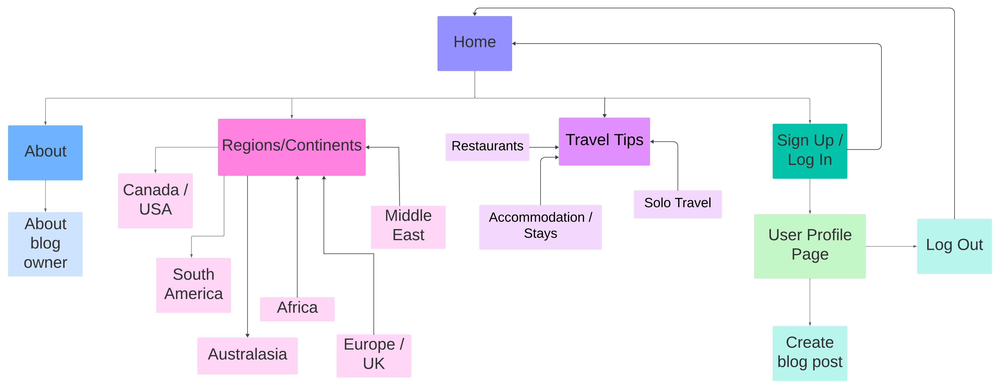

# The Globetrotter's Gazette
## Introduction

Welcome to the Globetrotter's Gazette, a place to share your travel experiences from all around the world. Read posts from all different countries, share these posts, even join in the conversation by leaving a comment! This is a community for globetrotter's alike to come together and share their love of travelling.

This website is made using the Django framework, alongside HTML, CSS, Javascript and Python. This is the 4th project in the Full Stack Software Development Diploma from Code Institute.

## Table of Contents

## User Experience (UX)

Development of this blog site was done using the five planes of UX as guidance. Below are the details listed for each plane.

### The Strategy Plane

The goal of 'The Globetrotter's Gazette' is to create an online community for people who love to travel, allowing them to share their experiences with each other. Users can create blog posts to share with others and can also search for other blog posts of their interest.

#### Business Needs

- Create a website for people to share their travel stories
- Allow travellers - novice and experienced - to get inspiration for their next trip

#### User Needs

- Blog about my travels to be able to store my memories online
- Read about others' experiences to get ideas for my next holiday/ expand my knowledge
- Engage with others and their travels by commenting on posts
- Be able to create an account to leave comments
- Be able to create an account to create my own posts

### The Scope Plane

#### Epics

7 epics were generated for this project, which were further broken down into user stories before starting development. Each epic and their related user stories can be seen on my [project board](https://github.com/users/mariam138/projects/6/views/1).

**Epic [1](https://github.com/mariam138/globetrotters-gazette/issues/2)**: Initial Django Setup  
**Epic [2](https://github.com/mariam138/globetrotters-gazette/issues/3)**: User Authentication  
**Epic [3](https://github.com/mariam138/globetrotters-gazette/issues/4)**: User Profile  
**Epic [4](https://github.com/mariam138/globetrotters-gazette/issues/5)**: User Travel Posts  
**Epic [5](https://github.com/mariam138/globetrotters-gazette/issues/6)**: Searching Travel Posts  
**Epic [6](https://github.com/mariam138/globetrotters-gazette/issues/7)**: Admin Profile  
**Epic [7](https://github.com/mariam138/globetrotters-gazette/issues/8)**: User Interaction  

#### User Stories

The seven epics listed above were split down further into user stories to help with the development of the project. User stories were labelled using **MoSCoW Prioritisation**. User stories were also labelled with story points, based on relative effort. For each iteration, a **milestone** was created to keep track of user stories. **Must have** stories were worked on first during each iteration, followed by **Should have** and finally **Could have**. User stories labelled with **Won't have** remained in the [Back log](https://github.com/mariam138/globetrotters-gazette/milestone/1) milestone.

### The Structure Plane

For the structure, I briefly created a simple site map. This allowed me to make sure there was flow throughout the design of the website, and that the correct pages linked together. This was created before the creating each page and was used as a template. The site map was created using **Lucidchart**.

### The Skeleton Plane

### The Surface Plane

## Features

## Future Features

## Testing

## Deployment

The final project was deployed using Heroku via these steps:

1. Sign in to Heroku
2. Click *'Create New App'* located at the top of the dashboard
3. Create a unique app name
4. Choose 'Europe' as the server
5. Click *'Create App'*
6. On the app's dashboard, click on *'Deploy'*
7. Click **Github** for the deployment method
8. Search for repository and connect to it on Heroku
9. Click on *Settings* on the app dashboard
10. Scroll down and click on *'Reveal Config Vars'*
11. For initial deployment, insert the following key:value pairs:
    - DATABASE_URL : *<database_url>*
    - SECRET_KEY : *<secret_key>*
    - DISABLE_COLLECTSTATIC : *1*
12. Click on *'Deploy'* to go back to the deploy tab
13. Scroll down to *Manual deployment*
14. Ensure the *'main'* branch is selected
15. Click *'Deploy Branch'*

### Forking the repository

A fork of this repository can be made to add your own changes **without** affecting the original repository. This can be done via the following steps:  
1. Click on the repository name
2. Click the *Fork* dropdown menu
3. Select *Create a new fork*
4. Rename the repository name if you wish
5. Click on *Create fork*

### Cloning the repository

You can clone this repository to create a remote copy on your local machine. This can be done via the following steps:  
1. Navigate to the repository on Github
2. Click the *'<> Code'* button at the top of the repository page
3. Copy the URL for repository
    - For HTTPS, copy the URL under the *HTTPS* section
    - For SSH, copy the SSH Key under the *SSH* section
    - For Github CLI, click the button next to the URL under the *Github CLI* section
4. Open a new terminal in your coding space
5. Type `git clone` followed by the URL that has been copied
6. Press *'Enter'* to create your local clone

## Acknowledgments